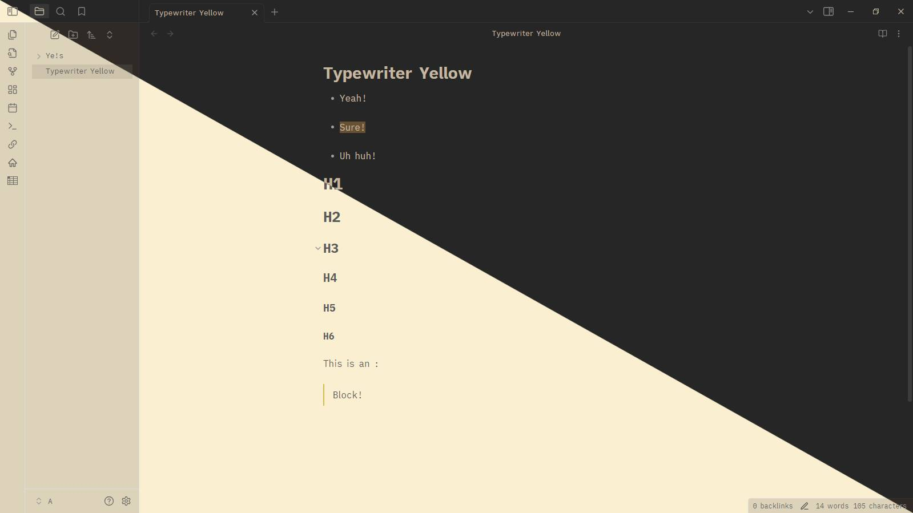

# Obsidian Typewriter

Typewriter Yellow is yellow version of the theme Typewriter which is an October-winning theme designed for a focused writing experience on [Obsidian](https://www.obsidian.md) 

## Features

- Careful choice in fonts; monospace in the editor and semi-proportional in preview and UI
- Fonts have been base64 encoded, meaning you don't need to install them to use Typewriter
  - This means that the fonts used here are available on mobile
- Markdown formatting symbols are faded and shrunk, letting you focus on words instead
- Vim cursor support
- Long titles in the file explorer will soft-wrap
  - Useful for mobile and small displays
- Seamless embeds, without file titles
- Cool dark mode and warm light mode
- Compatibility with community plugins (see [Plugin Compatibility](#plugin-compatibility))
- Compatibility with Obsidian Hub
- Highlight on the active line for focus
  - Currently unavailable in v2.0.0 (Obsidian version 0.16.0 onwards)
-It's yellow. Yeah. Yellow, not green (pretty big stuff huh?)

## Installation

### Recommended (Obsidian Theme Manager)

1. Open Settings
2. Navigate to Appearance
3. Press the 'Manage' button
4. Search for Typewriter and press 'Install'

### Manual

You can also manually install this theme.

For Obsidian version 0.16.0/1.0.0 and above:

1. Download `theme.css` and `manifest.json`
2. In your vault's hidden theme directory (`.obsidian/themes/`), create a `Typewriter/` directory
3. Move `theme.css` and `manifest.json` into the `.obsidian/themes/Typewriter` folder

For Obsidian version 0.15.9 and below:

1. Download `obsidian.css`
    - Please note that `obsidian.css` has been deprecated. Development will focus more on `theme.css`.
2. Rename the file to `Typewriter.css`
3. Move the file to your vault's theme directory
    - Navigate to your vault's hidden `.obsidian/themes` folder
    - Place `Typewriter.css` inside that folder

## Credits

Inspiration and/or some code were taken from the following:

- [Main code by @crashmoney](https://github.com/crashmoney/obsidian-typewriter)
- [Minimal by @kepano](https://github.com/kepano/obsidian-minimal)
- [Yin and Yang by @chetachiezikeuzor](https://github.com/chetachiezikeuzor/Yin-and-Yang-Theme)
- [Deep Work by @nikbrunner](https://github.com/nikbrunner/obsidian-deep-work-theme)
- the Scrivener theme A Midsummer Night for the colors behind Typewriter's dark mode
- Solarized Light for the colors behind Typewriter's light mode

### Fonts

This theme uses the fonts iA Writer Mono V, iA Writer Quattro S and JetBrains Mono. These fonts have been base64 encoded into the theme CSS, meaning that you don't have to install them and that they are available on mobile. If you want to, however, the links are below:

- [iA Writer Fonts (GitHub)](https://github.com/iaolo/iA-Fonts)
- [JetBrains Mono (Google Fonts)](https://fonts.google.com/specimen/JetBrains+Mono#standard-styles)
